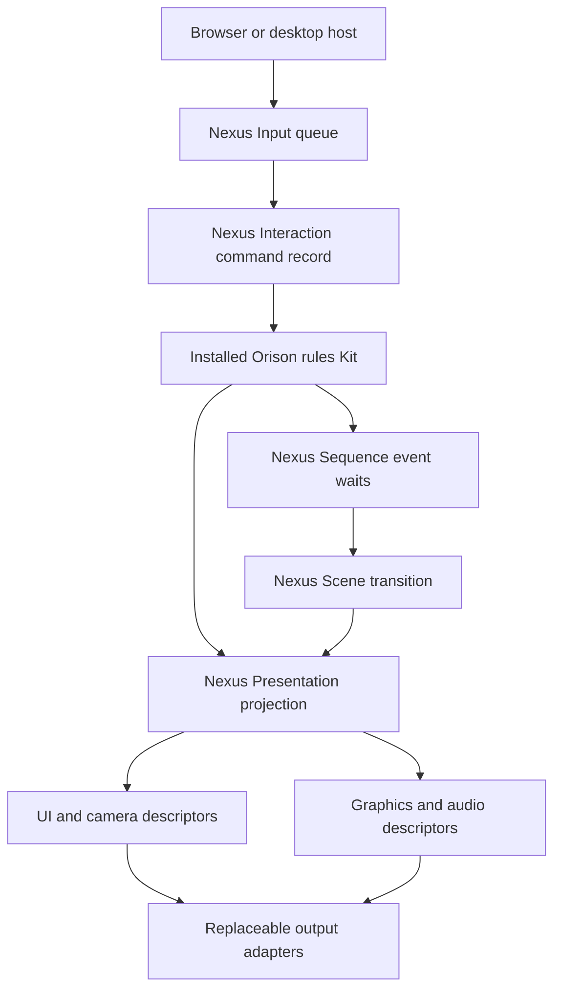

# Nexus ownership and compatibility

Pinned engine: `bacc8fc0073bf92910e26776a6695d2b8ec45858`, package `0.0.4`. Game baseline: original README-only main `482119ccfedcd08e6aa60e1c17582a24f95e1924`. No engine repository changes are included.

## Causal chain

The host measures elapsed wall time, runs a bounded 30Hz accumulator, and calls `engine.tick(1/30)`. Runtime clamps its public clock delta (default maximum 1/15), orders input/simulate/resolve/cleanup phases, and owns sequence node execution. The product's simulation task uses the applied engine clock delta. It does not introduce its own timer or mutate a provider.

## Actual installed ownership

| Public surface | What this game uses it for | Implementation |
|---|---|---|
| Runtime Sequence | Three finite event waits: records verified, mechanism complete, departure accepted | Default installed engine Sequence, called in Orison Kit |
| Interaction Input | Bounded pending command queue from actual host devices | composition/game.js and host/browser.js |
| Interaction | Last semantic command and stable interaction targets | Orison Kit |
| Spatial / World / Scene | Registered rooms, gated exits, authoritative current scene | composition/game.js |
| Object registry | Four active renderer-neutral prop identities per room | Orison Kit syncObjects |
| Simulation + product extension | Authoritative game progress, equipment, clues, decisions, exposure | game/kits/orison-kit.js |
| Asset registry | Fifteen canonical inline procedural scene records | composition/game.js |
| Presentation / UI / Graphics / Camera / Audio / Output | Portable visible meaning, interface, view, audio mix, surface sizing | presentation/projection.js |
| Three graphics adapter | Meshes, materials, textures, ray picking, draw calls | providers/graphics.js and three-scene.js |
| Web Audio adapter | Original synthesized ambience and cue tones | providers/audio.js |
| Storage adapter | Three serialized slots, prior copies, settings | providers/storage.js |

`n:simulation:orison` and `n:presentation:orison` are explicitly game-owned extensions installed using the public Kit contract. They are not claims that Nexus ships native inventory or Saint Orison domains. The game does not install unused Physics, Network, AI or Compute merely to make an architecture diagram larger.

## Sequence compatibility decision

The inspected engine still keeps Sequence under Runtime. This game uses its supported event-driven node API. `driveSequenceNodesWithTick:false` stops automatic per-frame node driving. The old legacy Sequence tick hook still exists in Nexus; no legacy graphs are installed by this game.

A room uses one finite graph: `inspect-records → operate → depart`. Product predicates collect evidence and determine outcomes; Sequence records the finite progression. Scene independently requires a solved-room token. An early exit cannot pass either through ordinary gameplay commands.

On transition/reload, the old node graph is cancelled and replaced. Save files retain logical clue/solution state; restore replays those facts into fresh wait nodes. It never serializes callbacks, subscriptions, graphics handles, AudioContexts or browser objects. This is logical game restoration, not an aggregate engine snapshot or multiplayer deterministic rollback implementation.

The proposed future optional root `n:sequence`, universal wake/sleep handles, worker barriers and Before/During/After leaf receipts are **not shipped by this change**. Adopting them needs a separately verified engine release. One active room does not justify replacing the engine scheduler.

## Authority and memory

Definitions are data. Active game progress is held in a Nexus resource. Scene and UI state are separate authorities, not mirrored objects in the host. Providers only accept output packets. Their caches are disposable representations.

Static meshes sharing geometry/material are instanced; interactive props keep individual IDs for picking. A scene change disposes geometry, textures and materials. The presentation layer caches a frozen snapshot read back from the authoritative Graphics scene descriptor. Changing game-specific visual effects live in the installed Orison Presentation resource, avoiding repeated copying of static room geometry. Whole-state cloning still occurs in the public domain contracts; this implementation is not evidence of a million-entity performance foundation.

Review controls exist only in development. They expose read-only snapshots and the ordinary bounded command entry, with no arbitrary global state setter. Browser review uses pointer input; direct command routes are labelled separately.
